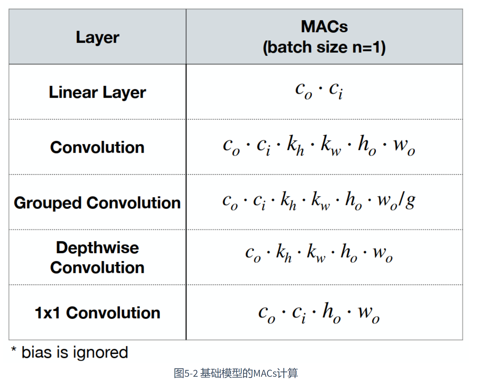
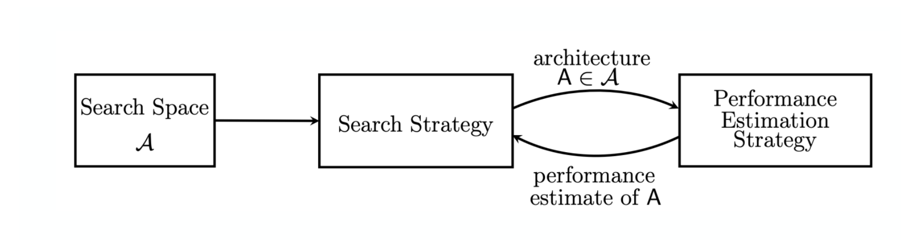
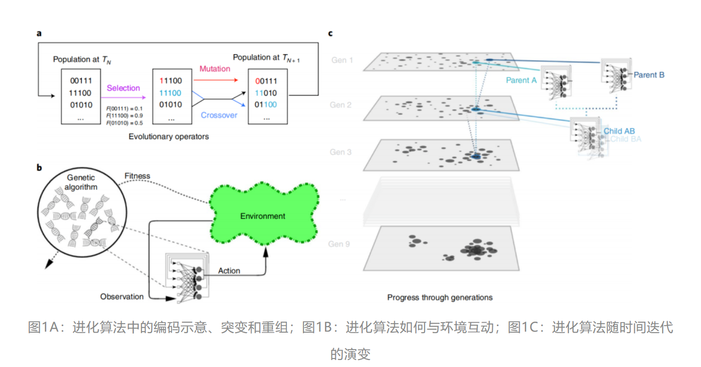

# llm-compresssion

Tags: Work
Property 2: No

将神经网络的结构，参数量，组合方式当做搜索空间，利用相关的搜索算法配合对搜索过程的模型评估以此来快速搜索到合适的神经网络架构与参数。我们把这种技术叫做“**神经网络架构搜索**”(Neural Architecture Search, NAS)。

回到一开始的目标，构建一个“有效模型”需要满足“**延时低**、**存储少**、**消耗少**，同时还要保持**模型精度**等几个目标。

对于多个目标，如果直接使用手工设计的方式，往往会比较难以满足不同的目标。所以，如果能够将上述的**目标转换为“优化目标”**，就能够通过某种优化方法，使得模型尽可能满足上述的所有目标。
   所以，从这个角度来说，“神经网络架构搜索”，在一定程度上，扩展了搜索空间，使得整个网络有更大的空间来完成上述的目标。

对之前的基础网络模型进行回顾，有：线性变换操作，卷积操作，分组卷积操作（5个）等

• **Number of computing operations**
就是模型的计算量，有FLOPs和MACs两种衡量的方式、简而言之，前者指的是乘加的数量，而后者指运算量。比如ResNet-152在前向传播一张256 * 256的图片的运算量可以达到20 GFLOPs。下面简单介绍下**模型计算量的计算方法：**

**几乎每篇论文中都会出现模型paramters与FLOPs指标的对比，本文简单介绍下其定义与快速计算方法。**

**FLOPs：**浮点运算次数，每一个加、减、乘、除操作都算1 FLOPs操作，常用来衡量模型计算复杂度。最近（2020年~2021年）已经有很多文章证明靠FLOPs间接标准评价模型的速度是不靠谱的，但此标准依然广泛用作模型速度的参考评价标准。

**MACs：**乘加累积操作数，常常被人们与FLOPs概念混淆（许多大厂的论文中也会混淆FLOPS、FLOPs、MACs三者的使用，如谷歌的Efficientnet论文）。实际上1MACs包含一个乘法操作与一个加法操作，大约包含2FLOPs。通常MACs与FLOPs存在一个2倍的关系。

**参考：**
FLOPs与MACs的区别：
(1)https://github.com/Lyken17/pytorch-OpCounter/tree/master/benchmark#macs-flops-what-is-the-difference
(2)https://github.com/Lyken17/pytorch-OpCounter/issues/46

### [**神经网络架构搜索的基本流程**](https://datawhalechina.github.io/awesome-compression/#/ch05/ch05?id=_531-%e7%a5%9e%e7%bb%8f%e7%bd%91%e7%bb%9c%e6%9e%b6%e6%9e%84%e6%90%9c%e7%b4%a2%e7%9a%84%e5%9f%ba%e6%9c%ac%e6%b5%81%e7%a8%8b)

其流程可以被看做是传统神经网络优化的扩展形式。首先先规定一个搜索空间�A，然后给定一些搜索策略，能够得到对应的神经网络架构模型，通过数据集评估该模型的性能，再将该结果反馈给搜索策略，给出迭代后的新神经网络架构。

今天给大家分享的是Neural Architecture Search（NAS）（神经网络架构搜索），即**通过强化学习方法，寻找最优的网络结构**。NASNet最大的贡献是解决了NAS无法应用到大数据集上的问题，它使用的策略是先在小数据集（CIFAR-10）上学一个网络单元，然后在大数据集上堆叠更多的单元的形式来实现模型迁移。本文将从：（1）NasNet的基本知识；（2）随机搜索（Random Search)；（3）可微搜索（Differentiable Neural Architecture Search)这三个方面进行介绍。

## [**搜索策略的介绍**](https://datawhalechina.github.io/awesome-compression/#/ch05/ch05?id=_54-%e6%90%9c%e7%b4%a2%e7%ad%96%e7%95%a5%e7%9a%84%e4%bb%8b%e7%bb%8d)

在规定好神经网络架构的搜索空间以后，为了能够找到符合目标的神经网络架构，就需要不同的搜索策略。在本小节，主要介绍5种搜索策略，分别是：网格搜索(Grid search)、随机搜索(Random search)、强化学习(Reinforcement learning)、梯度下降(Gradient descent)以及进化算法(Evolutionary search)。

## **进化算法简介**

进化算法是一类受自然进化机制启发的随机优化方法。主要包括遗传算法（Genetic Algorithms, GAs）、进化策略（Evolution Strategies, ES）、差分进化（Differential Evolution, DE）和遗传规划（Genetic Programming, GP）等。进化算法的基本思想是通过模拟生物进化过程中的选择、交叉、变异和遗传等操作，对候选解进行迭代优化，最终找到问题的最优解或接近最优的解

1. 遗传算法
    
    遗传算法是最典型的进化算法之一。其主要步骤包括：
    
    初始化种群：生成一组随机解作为初始种群。
    
    选择：根据适应度函数选择较优个体进入下一代。
    
    交叉：通过交换两个个体的部分基因，生成新的个体。
    
    变异：随机改变个体的部分基因，以增加种群的多样性。
    
    替换：将新生成的个体替换旧种群的一部分或全部。
    
2. 差分进化
    
    差分进化是一种专门用于实数优化问题的进化算法。其主要步骤包括：
    
    初始化种群：生成一组随机向量作为初始种群。
    
    变异：通过对当前种群向量进行差分变异，生成新的向量。
    
    交叉：对变异后的向量进行交叉操作，以保留父代个体的优良基因。
    
    选择：根据适应度函数选择优良个体进入下一代
    
    
    

## **杂交进化算法的基本思想**

杂交进化算法通过结合不同的优化技术，克服单一进化算法的局限性，以期获得更好的优化效果。常见的杂交策略包括

1. 全局搜索与局部搜索结合
    
    将进化算法的全局搜索能力与局部搜索方法的局部优化能力相结合。在进化过程中，通过引入局部搜索策略（如模拟退火、禁忌搜索）对部分个体进行局部优化，提高收敛速度和解的质量。
    
2. 多种进化算法结合
    
    将两种或多种不同的进化算法结合使用，发挥它们各自的优势。例如，将遗传算法与差分进化结合，通过交替使用不同算法，提高种群多样性和全局搜索能力。
    
3. 引入问题特定的启发式方法
    
    在进化算法中引入针对具体问题的启发式方法或知识，以提高算法的效率和优化效果。例如，在解决旅行商问题（TSP）时，可以结合邻域搜索方法（如2-opt、3-opt）进行局部优化