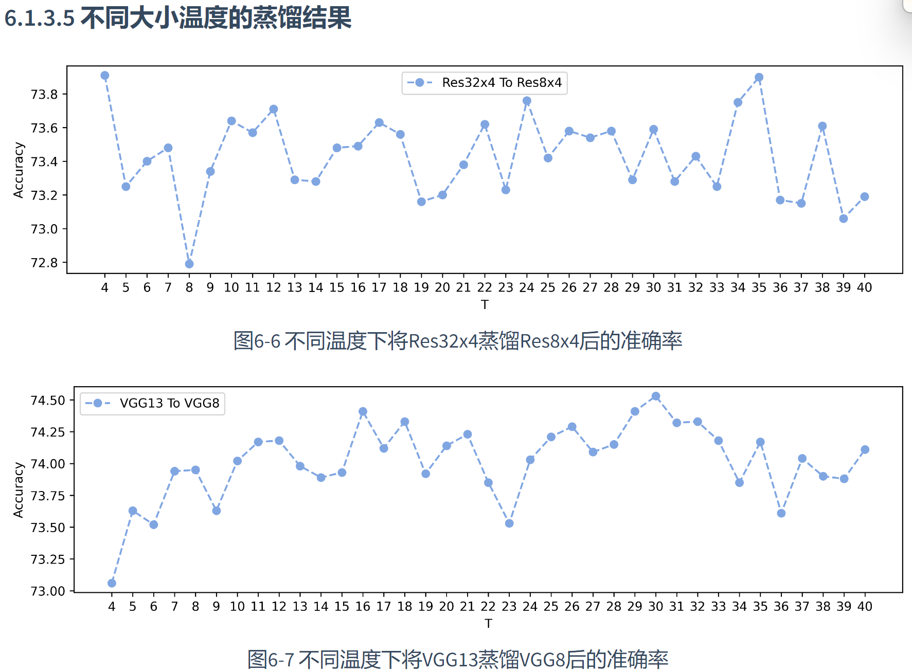

# llm-compresssion

Tags: Work
Property 2: No

将神经网络的结构，参数量，组合方式当做搜索空间，利用相关的搜索算法配合对搜索过程的模型评估以此来快速搜索到合适的神经网络架构与参数。我们把这种技术叫做“**神经网络架构搜索**”(Neural Architecture Search, NAS)。

回到一开始的目标，构建一个“有效模型”需要满足“**延时低**、**存储少**、**消耗少**，同时还要保持**模型精度**等几个目标。

对于多个目标，如果直接使用手工设计的方式，往往会比较难以满足不同的目标。所以，如果能够将上述的**目标转换为“优化目标”**，就能够通过某种优化方法，使得模型尽可能满足上述的所有目标。
   所以，从这个角度来说，“神经网络架构搜索”，在一定程度上，扩展了搜索空间，使得整个网络有更大的空间来完成上述的目标。

对之前的基础网络模型进行回顾，有：线性变换操作，卷积操作，分组卷积操作（5个）等

• **Number of computing operations**
就是模型的计算量，有FLOPs和MACs两种衡量的方式、简而言之，前者指的是乘加的数量，而后者指运算量。比如ResNet-152在前向传播一张256 * 256的图片的运算量可以达到20 GFLOPs。下面简单介绍下**模型计算量的计算方法：**

**几乎每篇论文中都会出现模型paramters与FLOPs指标的对比，本文简单介绍下其定义与快速计算方法。**

**FLOPs：**浮点运算次数，每一个加、减、乘、除操作都算1 FLOPs操作，常用来衡量模型计算复杂度。最近（2020年~2021年）已经有很多文章证明靠FLOPs间接标准评价模型的速度是不靠谱的，但此标准依然广泛用作模型速度的参考评价标准。

**MACs：**乘加累积操作数，常常被人们与FLOPs概念混淆（许多大厂的论文中也会混淆FLOPS、FLOPs、MACs三者的使用，如谷歌的Efficientnet论文）。实际上1MACs包含一个乘法操作与一个加法操作，大约包含2FLOPs。通常MACs与FLOPs存在一个2倍的关系。

**参考：**
FLOPs与MACs的区别：
(1)https://github.com/Lyken17/pytorch-OpCounter/tree/master/benchmark#macs-flops-what-is-the-difference
(2)https://github.com/Lyken17/pytorch-OpCounter/issues/46

### [**神经网络架构搜索的基本流程**](https://datawhalechina.github.io/awesome-compression/#/ch05/ch05?id=_531-%e7%a5%9e%e7%bb%8f%e7%bd%91%e7%bb%9c%e6%9e%b6%e6%9e%84%e6%90%9c%e7%b4%a2%e7%9a%84%e5%9f%ba%e6%9c%ac%e6%b5%81%e7%a8%8b)

其流程可以被看做是传统神经网络优化的扩展形式。首先先规定一个搜索空间�A，然后给定一些搜索策略，能够得到对应的神经网络架构模型，通过数据集评估该模型的性能，再将该结果反馈给搜索策略，给出迭代后的新神经网络架构。

今天给大家分享的是Neural Architecture Search（NAS）（神经网络架构搜索），即**通过强化学习方法，寻找最优的网络结构**。NASNet最大的贡献是解决了NAS无法应用到大数据集上的问题，它使用的策略是先在小数据集（CIFAR-10）上学一个网络单元，然后在大数据集上堆叠更多的单元的形式来实现模型迁移。本文将从：（1）NasNet的基本知识；（2）随机搜索（Random Search)；（3）可微搜索（Differentiable Neural Architecture Search)这三个方面进行介绍。

## [**搜索策略的介绍**](https://datawhalechina.github.io/awesome-compression/#/ch05/ch05?id=_54-%e6%90%9c%e7%b4%a2%e7%ad%96%e7%95%a5%e7%9a%84%e4%bb%8b%e7%bb%8d)

在规定好神经网络架构的搜索空间以后，为了能够找到符合目标的神经网络架构，就需要不同的搜索策略。在本小节，主要介绍5种搜索策略，分别是：网格搜索(Grid search)、随机搜索(Random search)、强化学习(Reinforcement learning)、梯度下降(Gradient descent)以及进化算法(Evolutionary search)。

## **进化算法简介**

进化算法是一类受自然进化机制启发的随机优化方法。主要包括遗传算法（Genetic Algorithms, GAs）、进化策略（Evolution Strategies, ES）、差分进化（Differential Evolution, DE）和遗传规划（Genetic Programming, GP）等。进化算法的基本思想是通过模拟生物进化过程中的选择、交叉、变异和遗传等操作，对候选解进行迭代优化，最终找到问题的最优解或接近最优的解

1. 遗传算法
    
    遗传算法是最典型的进化算法之一。其主要步骤包括：
    
    初始化种群：生成一组随机解作为初始种群。
    
    选择：根据适应度函数选择较优个体进入下一代。
    
    交叉：通过交换两个个体的部分基因，生成新的个体。
    
    变异：随机改变个体的部分基因，以增加种群的多样性。
    
    替换：将新生成的个体替换旧种群的一部分或全部。
    
2. 差分进化
    
    差分进化是一种专门用于实数优化问题的进化算法。其主要步骤包括：
    
    初始化种群：生成一组随机向量作为初始种群。
    
    变异：通过对当前种群向量进行差分变异，生成新的向量。
    
    交叉：对变异后的向量进行交叉操作，以保留父代个体的优良基因。
    
    选择：根据适应度函数选择优良个体进入下一代
    
    
    

## **杂交进化算法的基本思想**

杂交进化算法通过结合不同的优化技术，克服单一进化算法的局限性，以期获得更好的优化效果。常见的杂交策略包括

1. 全局搜索与局部搜索结合
    
    将进化算法的全局搜索能力与局部搜索方法的局部优化能力相结合。在进化过程中，通过引入局部搜索策略（如模拟退火、禁忌搜索）对部分个体进行局部优化，提高收敛速度和解的质量。
    
2. 多种进化算法结合
    
    将两种或多种不同的进化算法结合使用，发挥它们各自的优势。例如，将遗传算法与差分进化结合，通过交替使用不同算法，提高种群多样性和全局搜索能力。
    
3. 引入问题特定的启发式方法
    
    在进化算法中引入针对具体问题的启发式方法或知识，以提高算法的效率和优化效果。例如，在解决旅行商问题（TSP）时，可以结合邻域搜索方法（如2-opt、3-opt）进行局部优化
    
    # **知识蒸馏（Knowledge Distillation， KD）**
    
    如何将大模型的能力迁移到小设备上，以便在资源有限的条件下高效运行，成为了一个重要的研究方向。前面提到的模型剪枝、量化、神经网络架构搜索等技术分别从不同角度出发，解决模型压缩问题，旨在减少模型的参数和计算需求，从而适配边缘设备。
    
    在解决资源受限的边缘设备上运行AI模型的挑战时，**知识蒸馏（Knowledge Distillation， KD）** 是一种有效的模型压缩技术，旨在通过大模型（教师模型）的指导来训练小模型（学生模型），从而提高小模型的性能，同时保持计算和内存的高效利用。
    
    知识蒸馏的核心思想是通过让小模型（学生模型）学习大模型（教师模型）的行为模式，从而在减少计算成本和模型大小的同时，保留教师模型的性能。知识蒸馏的目标是对齐教师模型和学生模型的输出概率分布。知识蒸馏如下图所示：
    
    
    
    ### [**教师模型(Teacher Model)**](https://datawhalechina.github.io/awesome-compression/#/ch06/ch06?id=%e6%95%99%e5%b8%88%e6%a8%a1%e5%9e%8bteacher-model)
    
    - 一个预先训练好的复杂模型，通常性能优异，但计算开销大。
    - 提供软标签或者中间层的信息作为 “知识”，用于指导学生模型的学习。
    
    ### [**学生模型(Student Model)**](https://datawhalechina.github.io/awesome-compression/#/ch06/ch06?id=%e5%ad%a6%e7%94%9f%e6%a8%a1%e5%9e%8bstudent-model)
    
    - 一个较小、较简单的模型，旨在学习并模仿教师模型的行为。
    - 通过学习教师模型的“知识”，学生模型能够在较小规模上实现接近教师模型的性能。
    
    ### [**硬标签(Hard Target)**](https://datawhalechina.github.io/awesome-compression/#/ch06/ch06?id=%e7%a1%ac%e6%a0%87%e7%ad%behard-target)
    
    - 实际训练数据集中为每个输入样本分配的真实类别标签（即标准的分类标签，0或1）。
    - 硬标签是传统训练中使用的目标输出。
    
    ### [**软标签(Soft Target)**](https://datawhalechina.github.io/awesome-compression/#/ch06/ch06?id=%e8%bd%af%e6%a0%87%e7%ad%besoft-target)
    
    - 教师模型输出的概率分布，通常比硬标签(即One-Hot Lable)包含更多信息。
    - 通过温度调节(Temperature)将输出的概率分布软化，使得学生模型能更好地学习概率间的相对关系。
    
    ### [**交叉熵损失（Cross-Entropy Loss）**](https://datawhalechina.github.io/awesome-compression/#/ch06/ch06?id=%e4%ba%a4%e5%8f%89%e7%86%b5%e6%8d%9f%e5%a4%b1%ef%bc%88cross-entropy-loss%ef%bc%89)
    
    - 学生模型使用硬标签计算的标准分类损失函数（交叉熵）。
    - 衡量了模型预测的类别分布与真实标签之间的差异，帮助模型在常规分类任务中更好地学习。
    
    
    
    知识蒸馏的基本流程如上图所示，其中教师模型(Teacher Model)是已经训练好的模型，而学生模型(Student Model)则是需要被训练的模型。
    
    假设现在的任务是一个图像分类任务，�**x**为训练图片，�*y*为对应的真实标签 (也称为硬标签Hard Label)，�*K*表示分类任务的数据集对应的类别总数。
    
    - 输入图片�**x**进入教师模型。通过 Softmax 函数处理输出结果，生成软目标（soft target），即**p**=[*p*1,*p*2,...,*pK*]。教师模型的输出经过一个温度系数�*T*调整，用于平滑概率分布，从而为学生模型提供更丰富的知识。
    - 学生模型输入同样的图片**x**也经过 Softmax 函数生成其自己的输出概率分布。学生模型同样使用温度系数*T* 进行概率分布的平滑。
    - 软损失(Soft loss)是学生模型和教师模型输出之间的损失，通常通过 KL散度（Kullback-Leibler Divergence）来衡量。这部分损失帮助学生模型学习教师模型的预测分布。
    - 学生模型的输出还会与真实标签（hard target）[0,0，1,0,...,0,0][0,0，1,0,...,0,0]进行比较，计算交叉熵损失（cross-entropy loss），即硬损失。这部分损失确保学生模型在标准分类任务上仍然具有竞争力。
    - 软损失和硬损失的加权和形成总损失，使用权重参数*λ*控制两者的平衡。通过调节 *λ*，可以控制学生模型在多大程度上依赖教师模型的指导与真实标签。
    - 
    
    在模型压缩中使用**温度系数**进行概率分布平滑的主要原因与知识蒸馏（Knowledge Distillation）有关，它是一种通过将复杂模型（称为教师模型）简化到较小模型（称为学生模型）的技术。以下是详细解释：
    
    ---
    
    ### **1. 为什么使用温度系数进行概率分布平滑？**
    
    1. **知识蒸馏的核心目标**
        - 在知识蒸馏中，教师模型的输出往往是一个概率分布（通常是Softmax的输出），这些分布中包含了比直接的“硬标签”（如分类任务中的单一正确类别）更多的信息。
        - 例如，对于一张图片，教师模型可能预测某个类别的概率是0.6，而其他类别的概率分别为0.3和0.1，这种相对概率提供了类别之间的相关性信息。
            - **减少信息损失：**
                - 软目标（Soft Targets）比硬目标（Hard Labels）包含更多信息。例如，教师模型输出的概率分布可能是 `[0.6, 0.3, 0.1]`，而硬标签可能只有 `[1, 0, 0]`。
                - 增大温度系数 T>1 会让概率分布更加平滑，减少学生模型只关注最高概率类别，从而学习到更多的类别关系。
                    
                    T>1T > 1
                    
            - **避免过拟合：**
                - 过于尖锐的分布可能让学生模型过度拟合高概率类别，忽略次高概率类别。平滑分布有助于引导学生模型对所有类别进行合理学习。
            - **稳定梯度：**
                - 在较高温度下，概率分布中的较小值也会变得更加显著，这对梯度更新更有帮助。这样，学生模型在学习时能够获得更稳定和丰富的梯度信号。
    2. **温度系数的作用**
        - **平滑概率分布**：通过引入温度系数  调节Softmax函数的输出，使得分布更加平滑，低概率类别的信息被放大，更容易被学生模型学习。
        - **公式**：
        
        当  T>1 时，输出的概率分布更平滑；当T = 1  时为标准Softmax；当 T→ 0 时，分布接近于one-hot。
            
            
            
        
        当T增大时，概率分布变得更加平滑，信息密度更高。
        
    3. **信息的有效传递**
        - 平滑分布可以让学生模型更容易捕获教师模型提供的更丰富的知识（类别之间的关系），而非仅关注于单一的最优类别。
        - 这种细节可以帮助学生模型更好的理解输入样本的完整信息， 而不仅仅只是学习硬标签。保留更多的特征数据
    
    ### [**温度的大小对Logits的影响**](https://datawhalechina.github.io/awesome-compression/#/ch06/ch06?id=_6134-%e6%b8%a9%e5%ba%a6%e7%9a%84%e5%a4%a7%e5%b0%8f%e5%af%b9logits%e7%9a%84%e5%bd%b1%e5%93%8d)
    
    
    
    
    
    ---
    
    ### **2. 在别的模型中是否也会使用？**
    
    温度系数的思想并不仅限于知识蒸馏，它在其他模型中也有应用，尤其是在概率分布相关的任务中：
    
    1. **强化学习（Reinforcement Learning）**
        - 在策略选择（Policy Selection）时，Softmax函数与温度系数常用于探索与利用的权衡。
        - 高温度：增加探索行为；低温度：强调利用高概率的动作。
    2. **生成模型（Generative Models）**
        - 在文本生成或图像生成任务中，使用温度控制模型生成内容的多样性。
        - 高温度：生成更随机的内容；低温度：生成更确定性的内容。
    3. **分类模型训练**
        - 在多任务学习或不平衡分类中，平滑标签分布可以帮助模型更好地学习。
    
    ---
    
    ### **3. 使用场景、原因和目标**
    
    ### 使用场景：
    
    - **知识蒸馏**：教师模型指导学生模型学习。
    - **数据增强**：通过改变分布来生成具有多样性的样本。
    - **模型推理优化**：调整推理阶段的分布特性，如增强生成的多样性。
    
    ### 原因：
    
    - 提升学生模型的泛化能力。
    - 在概率预测任务中传递更细腻的信息。
    - 优化探索与利用之间的平衡（如强化学习）。
    
    ### 目标：
    
    - 改善小模型的性能，使其接近大模型。
    - 通过调整分布平滑特性，提高模型的鲁棒性或适应性。
    
    ---
    
    ### **4. 如何扩展应用？**
    
    1. **多模态知识蒸馏**
        - 跨领域蒸馏，例如从文本模型向视觉模型传递知识，温度系数可以帮助调整不同模态输出的分布特性。
    2. **连续学习（Continual Learning）**
        - 在防止灾难性遗忘中，将旧任务知识以平滑分布的形式融入新任务训练。
    3. **对抗学习（Adversarial Training）**
        - 通过调节分布平滑来减少对抗样本对模型的攻击效果。
    4. **压缩生成模型**
        - 在压缩大规模生成模型（如GPT、Diffusion模型）时，利用温度系数控制压缩后模型的生成质量。
    
    ---
    
    ### 总结
    
    温度系数的核心是通过调节Softmax的输出分布，赋予模型更多关于类别之间关系的信息。这种方法广泛适用于各种需要概率分布建模的场景，其扩展应用可以进一步优化模型性能、提高泛化能力并增强模型适应性。
    
    **当需要考虑负标签之间的关系时，可以采用较大的温度。例如，在自然语言处理任务中，模型可能需要学习到“猫”和“狗”之间的相似性，而不仅仅是它们的硬标签。在这种情况下，较大的温度可以使模型更好地捕捉到这些关系。反之，如果为了消除负标签中噪声的影响，可以采用较大的温度。**
    
    [**6.2.2 匹配中间层特征**](https://datawhalechina.github.io/awesome-compression/#/ch06/ch06?id=_622-%e5%8c%b9%e9%85%8d%e4%b8%ad%e9%97%b4%e5%b1%82%e7%89%b9%e5%be%81)
    
    可以通过匹配中间层特征的方式进行知识蒸馏。教师模型和学生模型在每个对应的中间层之间进行特征图匹配，通过计算 KD Loss 来最小化它们之间的差异。[**NST**](https://arxiv.org/abs/1707.01219)将学生网络经过训练，使其中间层的激活分布与教师网络的激活分布保持一致。使用最大平均差异（MMD）作为损失函数来衡量教师和学生特征之间的差异。
    
    https://arxiv.org/abs/1707.01219
    
    特征匹配
    
    ### **1. 什么是特征图匹配？**
    
    特征图匹配是一种在计算机视觉和深度学习中常用的技术，主要用于比较和匹配两个图像的特征信息。特征图匹配的目标是找到两个图像中相似或对应的区域，这些区域在一定程度上反映了图像内容的一致性。
    
    - **特征图**：通常是图像经过某种特征提取算法（如卷积神经网络、SIFT、ORB等）后生成的中间表示，可以是特定的关键点、描述子，或深度学习模型中的卷积特征层。
    - **应用场景**：主要用于图像配准、目标检测、物体识别、图像拼接、三维重建等任务。
    
    ---
    
    ### **2. 原理是什么？**
    
    特征图匹配的原理是通过提取和比较两个图像中的特征表示，找到对应关系，通常包括以下几个关键步骤：
    
    1. **特征提取**
        - 使用特定算法（如SIFT、SURF、ORB或深度学习的卷积层）提取图像的特征。
        - 这些特征可以是关键点（如边缘、角点）或更高维度的特征向量。
    2. **特征描述**
        - 使用特征描述子（Descriptor）对提取的特征进行编码，以便于计算相似度。
        - 描述子可以是局部的（如SIFT的128维向量）或全局的（如深度学习的嵌入向量）。
    3. **特征匹配**
        - 通过相似度度量（如欧氏距离、余弦相似度或交叉熵）比较两个特征图中的特征点。
        - 匹配策略可以是最近邻匹配（Nearest Neighbor Matching）或双向匹配（Bidirectional Matching）。
    4. **匹配优化**
        - 使用几何约束（如RANSAC、单应性矩阵）去除误匹配的点对。
        - 确保最终的匹配结果符合图像间的几何关系。
    
    ---
    
    ### **3. 常见方法有哪些？**
    
    特征图匹配的方法可以分为两大类：**传统特征匹配方法**和**深度学习特征匹配方法**。
    
    ### **3.1 传统方法**
    
    1. **SIFT (Scale-Invariant Feature Transform)**
        - 提取图像中的关键点和描述子，具有尺度不变性和旋转不变性。
        - 优点：稳定性好，适用于不同尺度和视角变化。
        - 缺点：计算复杂度高。
    2. **SURF (Speeded-Up Robust Features)**
        - 改进的SIFT版本，计算更快但精度略低。
        - 优点：速度快，适合实时应用。
        - 缺点：对光照变化敏感。
    3. **ORB (Oriented FAST and Rotated BRIEF)**
        - 基于FAST检测和BRIEF描述的快速方法，适合低计算资源场景。
        - 优点：速度快，适合实时应用。
        - 缺点：对尺度变化不够鲁棒。
    4. **Harris角点检测+描述子**
        - 通过检测图像角点并用简单描述子编码。
        - 优点：易实现，计算开销低。
        - 缺点：不具备尺度或旋转不变性。
    
    ### **3.2 深度学习方法**
    
    1. **CNN特征匹配**
        - 使用卷积神经网络的中间层特征（如ResNet、VGG）进行匹配。
        - 优点：能捕获高层语义信息，适用于复杂场景。
        - 缺点：依赖训练数据，可能对噪声敏感。
    2. **深度匹配（Deep Matching）**
        - 专门设计的深度神经网络，直接学习匹配关系。
        - 优点：端到端学习，精度高。
        - 缺点：需要大量训练数据。
    3. **SuperPoint + SuperGlue**
        - SuperPoint负责关键点检测和描述，SuperGlue通过图神经网络优化匹配。
        - 优点：高精度，强鲁棒性，对场景变化适应性好。
    4. **基于Transformer的匹配**
        - 使用视觉Transformer（如LoFTR）捕获长距离依赖关系。
        - 优点：能处理更大范围的特征，适合复杂匹配任务。
    
    ---
    
    ### **4. 各方法的区别和适用场景**
    
    | 方法 | 优点 | 缺点 | 适用场景 |
    | --- | --- | --- | --- |
    | SIFT | 鲁棒性强，精度高，适合复杂场景 | 慢，对实时性要求高的场景不适用 | 图像配准、3D重建 |
    | SURF | 计算速度快，精度适中 | 精度略低，对光照敏感 | 实时目标检测 |
    | ORB | 快速，适合低资源环境 | 对尺度变化不敏感 | 移动设备中的图像匹配 |
    | Deep Matching | 端到端，适合复杂场景 | 需要大量标注数据 | 目标检测、物体跟踪 |
    | SuperGlue | 高精度，能处理跨场景变化 | 计算复杂度较高 | 结构化场景重建 |
    | Transformer | 捕捉长距离依赖，适合大范围匹配 | 训练和推理时间较长 | 视频配准、广域场景匹配 |
    
    ---
    
    ### **5. 方法扩展的可能性**
    
    1. **结合传统和深度学习方法**
        - 例如，使用ORB检测关键点，CNN提取描述子，结合SuperGlue优化匹配关系。
    2. **多模态匹配**
        - 扩展到RGB+深度图像、光谱图像等多模态数据中。
    3. **动态匹配**
        - 在视频中引入时序信息，设计动态匹配模型。
    4. **大规模匹配**
        - 针对海量数据（如街景地图构建）优化匹配算法，提高效率和鲁棒性。
    
    特征图匹配的选择和设计应根据具体任务和应用场景权衡精度、速度和资源消耗。
    
    https://arxiv.org/abs/2407.07789 
    
    https://mp.weixin.qq.com/s/7kWXwlY-txCYpqRE9Eil-Q